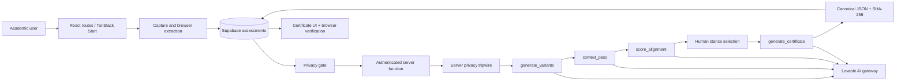

# Assayer — AI Assessment Governance Workbench

**Assayer** is a foundational web application for Australian higher-education academics who need to redesign assessments for generative AI while retaining demonstrable learning, academic integrity, student equity, accessibility, and human governance.

It is deliberately **not an AI detector**. Its central proposition is that assessment quality and governance should be improved through explicit task design, process evidence, contextual judgement, and accountable academic review rather than through unreliable attempts to infer whether text was generated by AI.

> **Important scope statement:** Assayer maps assessment designs to named Australian and international frameworks. It does **not** certify regulatory, institutional, professional-accreditation, privacy, or academic-policy compliance. Generated outputs are drafts for qualified academic review.

## Product purpose

Generative AI changes the conditions under which a conventional take-home assessment can evidence learning. An assessment may remain aligned to its course learning outcomes yet become weak evidence of a student's own judgement, verification, process, ethical reasoning, or contextual application. Assayer is intended to make that design problem inspectable and actionable.

The workbench takes an assessment an academic already uses, records its educational context, applies a privacy gate, produces three deliberate redesign options, localises generic examples to an Australian context, scores the redesigns against five adaptive capabilities, and files a hash-stamped governance record called an **Assay Certificate**.

## Core utility

Assayer provides a single, repeatable workflow for:

1. **Capturing** an assessment brief and its unit/program context.
2. **Preventing avoidable personal-information disclosure** before model processing.
3. **Generating alternatives**, rather than asserting one supposedly correct redesign.
4. **Making student process evidence assessable**, including drafts, prompt logs or preparation logs, decision memos, and responses to feedback.
5. **Testing contextual fit** against a curated Australian anchor table.
6. **Making judgement criteria explicit** through strict 5 × 20 scoring.
7. **Recording the AI system, prompt version, human decision, standards mapping, declarations, and integrity hash** in a durable governance log.
8. **Allowing independent browser-side hash verification** of the stored certificate JSON.

## What makes the approach distinct

The differentiator is the combination of assessment redesign and governance evidence in one constrained workflow:

- **Redesign instead of detection:** the product changes the assessment conditions rather than attempting to police authorship through probabilistic AI-text detection.
- **Three-stance design space:** academics can compare AI-Assisted, AI-Limited, and AI-Resistant options for the same learning purpose.
- **Process evidence as an object of assessment:** the student's reasoning, verification, decisions, and feedback response become visible and assessable.
- **Privacy as a technical precondition:** the privacy gate is enforced in both the browser and the server AI gateway; passing the browser screen alone is insufficient.
- **Context localisation with a bounded table:** the localisation pass is restricted to verified database anchors and records the substitutions made.
- **Strict scoring rather than inflated celebration:** five criteria are each scored from 0–20, with prompt instructions that treat 100 as practically unreachable and competent designs as normally landing between 50 and 80.
- **Human decision provenance:** the certificate records the selected stance, model, prompt-registry version, process passes, and the named human decision-maker.
- **Tamper-evident presentation:** the certificate is canonicalised using recursively key-sorted JSON and fingerprinted with SHA-256; the browser can recompute and compare the fingerprint.

These features do not remove the need for institutional governance, subject-matter expertise, legal advice, accessibility consultation, or academic judgement. They make those responsibilities more explicit and reviewable.

## End-to-end user journey

### 1. Capture

An authenticated user enters or uploads an assessment and records:

- provider;
- unit code and title;
- program;
- Australian Qualifications Framework (AQF) level;
- discipline;
- cohort size;
- delivery mode;
- TEQSA reform pathway: program-wide, unit-level, or hybrid;
- unit coordinator and school;
- course learning outcomes; and
- the existing assessment text.

PDF, DOCX, TXT, and Markdown uploads are extracted in the browser by `src/lib/extract.ts`. The file itself is not uploaded by the capture interface; the extracted text is then saved as assessment data. A realistic BUSN2045 corporate-governance case-report example is available through the demo loader so the full journey can be demonstrated without real institutional data.

### 2. Privacy gate

The browser scans the captured text and presents highlighted findings for review. The scanner in `src/lib/privacy-scan.ts` recognises:

- email addresses;
- Australian mobile, landline, and international phone formats;
- TFNs using checksum validation;
- Medicare numbers using structural and checksum checks;
- ABNs using checksum validation;
- student IDs;
- dates of birth;
- street addresses; and
- probable personal names in common labelled or titled forms.

Identifiers must be removed. Probable staff or author names may be retained only through an explicit keep action and declaration. The user must complete three declarations, including that no student personal information remains and that processing is blocked until the text is clean.

The application stores the original text separately from the cleaned text, alongside a privacy record containing the number initially flagged, number removed, retained names, declaration states, and scan time.

### 3. Server-side privacy tripwire

Every AI operation calls `tripwire()` before the model is contacted. It re-scans the cleaned assessment text, learning outcomes, unit title, and program, excluding only explicitly retained names. Any remaining finding raises `ANONYMISATION_VIOLATION` with HTTP 422 and stops the operation.

This is a defence-in-depth control, not a guarantee that all personal information has been identified. It is a deterministic pattern/checksum scanner and should be supplemented by institutional privacy review for deployment.

### 4. AI-Assisted, AI-Limited, and AI-Resistant redesigns

The first AI pass generates all three variants in parallel from the same assessment context:

| Stance       | Design rule               | Intended AI condition                                                                                                              |
| ------------ | ------------------------- | ---------------------------------------------------------------------------------------------------------------------------------- |
| AI-Assisted  | AI designed in            | Students may use generative AI openly, but must document, verify, and critique its output.                                         |
| AI-Limited   | AI designed to be bounded | AI is permitted only for explicitly named steps; the remaining work is completed unaided.                                          |
| AI-Resistant | AI designed out           | An AI answer alone cannot pass; the task uses features such as live defence, local data, in-class performance, or oral moderation. |

Each variant has a fixed structured contract containing:

- title and student-facing brief;
- course-learning-outcome mapping;
- AI Assessment Scale (AIAS) level;
- AI-use conditions;
- authenticity and security safeguards;
- a marking rubric with high-standard and pass descriptors;
- Australian context anchors;
- feasibility notes and marking arithmetic;
- a four-item Process Evidence Kit; and
- a `[VERIFY]` register for claims requiring human checking.

The Process Evidence Kit is required to contain exactly four artefacts:

1. dated draft/version history;
2. AI prompts-and-outputs log, or a preparation log for an AI-Resistant design;
3. decision memo recording what was tried, retained, or discarded and why; and
4. feedback-response note.

### 5. Australian context pass

The second pass compares each draft with `context_anchors`. It can replace generic overseas examples only with the Australian equivalent present in the verified table. It records genuine substitutions with the source. If no suitable entry exists, it writes `[context: to be confirmed by the academic]` rather than inventing an institution or rule.

The seed table includes examples spanning business, information technology, health, education, and engineering, including Australian organisations and frameworks such as ASIC, ACCC, RBA, ATO, APRA, AASB, TEQSA, HESF, OAIC, ASD Essential Eight, Ahpra, TGA, Engineers Australia, Safe Work Australia, and the National Construction Code. The table is a starting point and requires institutional maintenance and source checking.

### 6. Adaptive Capabilities Alignment scoring

The third pass scores every stance against exactly five criteria worth 20 marks each:

1. evaluative judgement of AI output;
2. verification and sourcing;
3. metacognitive regulation and process evidence;
4. ethical reasoning and responsible AI practice; and
5. contextual application to the Australian setting and communication of judgement.

Scores are clamped to 0–20 per criterion and summed to a maximum of 100. The implementation preserves a justification for every criterion. The prompt explicitly asks the model to be strict, to treat 100 as practically unreachable, and to require exceptional evidence for a score above 17.

The scoring is an aid to structured review, not a psychometrically validated measurement instrument. It should be calibrated against institutional exemplars during a pilot.

### 7. Assay Certificate

After a stance is selected, the certificate pass creates a nine-section Faculty AI Governance Log:

1. Identification
2. Original Assessment Summary
3. Redesign Rationale
4. AI Tools and Systems Considered and Used
5. Pedagogical Justification
6. Adaptive Capabilities and Employability Alignment Reasoning
7. Standards and Frameworks Mapping
8. Integrity, Fairness, Accessibility and Contestability
9. Declaration

The log records the selected stance, AIAS label, privacy outcome, model name, prompt-registry version, generation passes, localisation swaps, guardrail mapping, human decision record, scores, framework mappings, equity notes, accessibility adjustments, declaration text, signature roles, and academic-board routing reference.

The certificate is persisted once and reused unless the user explicitly regenerates it. Regeneration records the previous hash, timestamp, and replacement hash in a supersession history. The UI supports browser-side hash verification and print/save-as-PDF through the browser print mechanism.

## Technical architecture



### Front end

- React 19 with TypeScript.
- TanStack Start and TanStack Router for file-based routing and server functions.
- TanStack Query for assessment reads and cache invalidation.
- Tailwind CSS and Radix UI primitives for the interface.
- `src/routes/index.tsx` contains the public landing page.
- `src/routes/auth.tsx` handles email/password and Google OAuth entry points.
- Authenticated routes live under `src/routes/_authenticated/` and use route guards.
- `src/components/brand.tsx` provides the shared authenticated shell, navigation, stepper, wordmark, and footer.

### Server boundary

The AI SDK is intentionally absent from page components. All model work enters through the single server function in `src/lib/ai/gateway.functions.ts`:

```text
POST server function
{ task, payload: { assessmentId, stance?, regenerate? } }
```

The input is validated by Zod. The request requires Supabase authentication. Valid tasks are:

- `generate_variants`;
- `context_pass`;
- `score_alignment`; and
- `generate_certificate`.

`src/lib/ai/gateway.server.ts` is server-only. It loads the assessment, runs the privacy tripwire, dispatches the task, validates structured model output, writes the result, and translates known failures into explicit gateway errors.

### Model and prompt configuration

`src/lib/ai/config.server.ts` is the sole location where the model and gateway endpoint are named. The current repository configuration is:

- gateway: `https://ai.gateway.lovable.dev/v1`;
- model: `openai/gpt-6-astra`; and
- reasoning effort: low.

`src/lib/ai/prompts.server.ts` is a versioned prompt registry. The current version is `assayer-prompts/2026.09.1`. The preamble fixes Australian English and terminology, prohibits AI-detection recommendations, prohibits unsupported compliance claims, requires `[VERIFY]` for uncertain claims, and inserts a Cultural Protocol Gate when Aboriginal and Torres Strait Islander knowledge would otherwise be generated without appropriate direction.

### Structured generation and validation

The gateway uses the Vercel AI SDK with OpenAI-compatible provider configuration and Zod schemas for structured output. The schemas require fields for variants, context swaps, scores, and certificate narrative content. If a provider returns parseable JSON outside the normal structured-output path, the gateway attempts a schema-validated fallback. Otherwise it reports a controlled failure.

The gateway sets `store: false` for provider reasoning configuration. It also propagates an AI gateway run identifier when supplied by the provider and translates credit exhaustion and rate-limit responses into explicit application errors.

### Persistence

Supabase PostgreSQL stores one principal `public.assessments` row per captured assessment. Important fields include:

- source and cleaned assessment text;
- unit metadata and learning outcomes;
- JSONB privacy state;
- JSONB three-stance variants;
- JSONB context swaps;
- JSONB scores;
- selected stance;
- JSONB certificate;
- certificate SHA-256 hash;
- certificate supersession history;
- prompt version and model name;
- lifecycle status; and
- created/updated timestamps.

`public.context_anchors` stores the shared Australian localisation table, including discipline, generic term, Australian equivalent, source, and last-checked date.

### Authentication and authorisation

Supabase Auth supplies the authenticated identity. The assessment table enables row-level security and applies ownership policies for select, insert, update, and delete using `auth.uid() = user_id`. Authenticated pages also use route-level checks. The server middleware validates the bearer token before the AI gateway runs.

The service-role client exists only in server-side integration code for operations requiring administrative access. It is not imported into page routes. The browser client is used for normal user-authenticated queries under RLS.

## Lifecycle and state machine

The principal assessment status progression is:

```text
draft
  -> drafted       generate_variants
  -> localised     context_pass
  -> scored        score_alignment
  -> certified     generate_certificate
```

The processing route resumes from the stored status rather than blindly repeating completed passes. The certificate operation can return an existing certificate without another model call, or regenerate it when explicitly requested. Regeneration is not silent: the prior certificate hash is retained in the supersession record.

## Integrity and audit model

The certificate integrity mechanism is deliberately simple and inspectable:

1. construct the certificate log as a JSON object;
2. recursively sort object keys while preserving array order;
3. serialise the canonical representation without undefined fields;
4. compute a SHA-256 digest using Web Crypto;
5. store the JSON log and digest; and
6. independently repeat steps 2–4 in the browser on user request.

A matching digest demonstrates that the retrieved JSON matches the stamped JSON under this canonicalisation procedure. It does **not** prove that the original content was true, that the model was correct, that a database administrator could never replace both fields, or that a certificate is a legal or regulatory attestation. Those limitations should be stated in any audit or institutional assurance process.

## Privacy, safety, and governance controls

Implemented controls include:

- browser-side extraction rather than file upload at capture;
- explicit privacy review before the assay begins;
- identifier-specific pattern and checksum checks;
- a server-side re-scan immediately before every model task;
- a single auditable AI gateway;
- schema validation of model outputs;
- versioned prompts and recorded model configuration;
- `[VERIFY]` and context-confirmation pathways rather than fabricated facts;
- a prohibition on AI-detection recommendations;
- explicit human selection of the final stance;
- explicit declaration that generated outputs are reviewed drafts;
- equity and accessibility sections in the certificate; and
- hash verification plus supersession history.

## Current limitations and non-claims

This is the foundational build, not a production-ready institutional governance platform. Auditors and academic reviewers should pay particular attention to the following:

- The privacy scanner is deterministic and pattern-based; it is not a complete privacy classifier or de-identification proof.
- Personal information can be present in forms the rules do not recognise. Human review remains necessary.
- The source text and cleaned text are persisted in Supabase. Institutional retention, deletion, residency, access, backup, and processor arrangements still require policy decisions.
- The certificate hash is tamper-evident for the stored log but is not a digital signature, trusted timestamp, or append-only external ledger.
- The certificate is not countersigned in the current build; the UI records signature roles and a `Not yet countersigned` status.
- The model can produce incorrect, incomplete, biased, or stale prose. Structured validation confirms shape, not truth.
- The Australian anchor table is seeded data, not an automatically maintained legal or regulatory knowledge base.
- Framework mapping is generated reasoning and must be checked against current source instruments and institutional policy.
- The scoring model has not yet been empirically validated for inter-rater reliability, predictive validity, or fairness.
- Role-based access, countersignature workflows, oversight dashboards, distribution exports, versioned editing, and formal pilot hardening are deferred.
- The implementation currently uses browser print/save-as-PDF rather than a controlled letterheaded export pipeline.

## Suggested audit questions

An institutional auditor or academic reviewer can use these questions to interrogate the implementation:

1. Can a user reach an AI task without passing the privacy route and the server tripwire?
2. Can one authenticated user read another user's assessment row under the RLS policies?
3. Are the exact model and prompt versions recorded in the certificate?
4. Is the final stance selected by a human rather than automatically imposed?
5. Can each score be traced to a criterion, numerical value, and written justification?
6. Can every Australian context substitution be traced to an anchor source?
7. Is a regenerated certificate distinguishable from its predecessor?
8. Does browser recomputation reproduce the stored SHA-256 hash?
9. Which statements are direct framework mappings, and which are marked for institutional confirmation?
10. What retention, deletion, access, processor, and breach-response controls surround the Supabase deployment?
11. How will accessibility, cultural safety, and equity impacts be evaluated with affected students and staff?
12. What human moderation process is required before an assessment is approved for use?

## Repository map

```text
src/
  components/brand.tsx                 Shared shell, navigation, stepper, attribution
  components/variant-card.tsx          Structured redesign result presentation
  integrations/supabase/               Browser/server clients, auth middleware, types
  lib/ai/config.server.ts              Model and endpoint configuration
  lib/ai/gateway.functions.ts          Authenticated single AI server function
  lib/ai/gateway.server.ts             Task dispatch, tripwire, schemas, persistence
  lib/ai/prompts.server.ts             Versioned prompt registry
  lib/canonical.ts                     Canonical JSON and SHA-256 implementation
  lib/privacy-scan.ts                  Australian identifier scanner and redaction
  lib/types.ts                         Stances, variants, scores, and privacy types
  routes/index.tsx                     Public landing page and public footer
  routes/auth.tsx                      Authentication entry point
  routes/_authenticated/                Capture, privacy, processing, results, certificate
supabase/
  migrations/                          PostgreSQL schema, RLS, triggers, anchor seed data
PLAN.md                                Implemented stages and deferred roadmap
```

## Development

Requirements: Node.js and npm (or an equivalent Node package manager).

```sh
git clone https://github.com/wmchikwanha/ai-assessor-au.git
cd ai-assessor-au
npm install
npm run dev
```

Useful scripts:

```sh
npm run build     # production build
npm run lint      # ESLint
npm run format    # Prettier
```

The deployed application is currently linked from the Lovable project:

- Live app: https://ai-assessor-au.lovable.app
- Lovable editor: https://lovable.dev/projects/46b2af7b-c320-4d8f-ac59-ba33f4e170e2

## Roadmap

The repository's staged plan identifies these deferred capabilities:

- controlled letterheaded certificate export;
- assessment editor and versions;
- LMS HTML, rubric CSV, and DOCX distribution;
- roles, countersignature, and program oversight dashboard;
- anchor provenance UI, exemplar bank, and Cultural Protocol Gate tests;
- hardening, security review, and pilot evaluation.

## Attribution

Developed by Walter C. Copyright 2026.

Assayer maps to — and does not certify compliance with — TEQSA guidance, HESF 2021, AQF, and the ACSES Framework.
